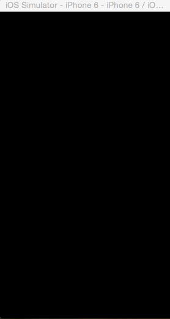

# RottenTomatoes
Rotten Tomatoes Demo iOS App

This is a read only Rottem Tomatoes demo app that shows the top dvd rentals. 
The idea was to get introduced to TableView, ScrollView, HUD and netwrok error.

Time Spent : 6 hours

Completed user Stories

* [x] Required : User can view a list of movies from Rotten Tomatoes. Poster images must be loading asynchronously.
* [x] Required : User can view movie details by tapping on a cell.
* [x] Required : User sees loading state while waiting for movies API. You can use one of the 3rd party libraries at [cocoa Pods](http://cocoapods.wantedly.com?q=hud).
* [x] Required : User sees error message when there's a [networking error](http://forums.androidcentral.com/attachments/google-nexus-10-tablet/51236d1355614625t-facebook-network-error-no-internet-connection-screenshot_2012-12-15-15-15-05.png). You may not use UIAlertView or a 3rd party library to display the error. 
* [x] Required : User can pull to refresh the movie list. Guide: [Using UIRefreshControl](http://courses.codepath.com/courses/ios_for_designers/pages/using_uirefreshcontrol)
* [x] Required : 

Incomplete Stories : 

* Optional : Add a tab bar for Box Office and DVD.
* Optional : Implement segmented control to switch between list view and grid view
  * Hint: The segmented control should hide/show a UITableView and a UICollectionView
* Optional : Add a search bar.
  * Hint: Consider using a UISearchBar for this feature. Don't use the UISearchDisplayController.
* Optional : All images fade in 
  * Hint: Use the - (void)setImageWithURLRequest:(NSURLRequest *)urlRequest method in AFNetworking. Create an additional category method that has a success block that fades in the image. The image should only fade in if it's coming from network, not cache.
* Optional : For the large poster, load the low-res image first, switch to high-res when complete
* Optional : Customize the highlight and selection effect of the cell.
* Optional : Customize the navigation bar.

Notes :

Questions :
* How to display the image loading HUD until the poster loads?

Walkthrough of all user stories:

GIF created with [LiceCap](http://www.cockos.com/licecap/).

